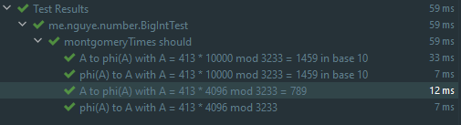
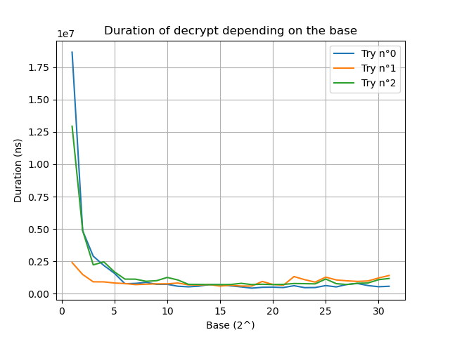
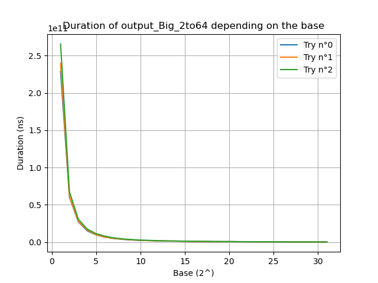
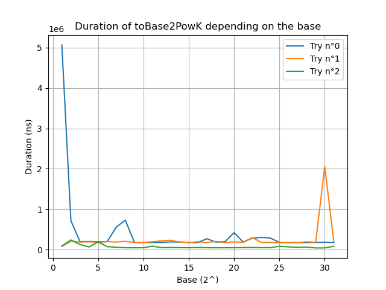
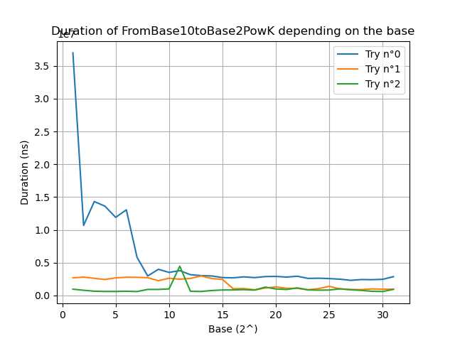
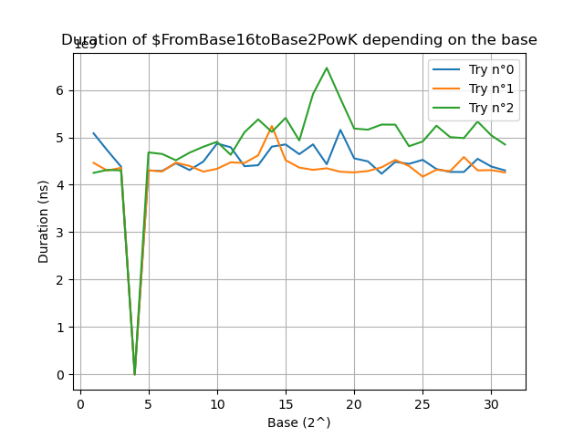

# RSA DIY with Large Numbers

## Conception de la structure Grand Nombre

Notre objet `BigInt` stocke :

- `mag` : Un array de magnitude de type `UIntArray` avec les éléments dans la base de travail, en little endian. (ex : `{0, 1, 0, 1}` en base 2 ou`{0, 1}` en base 10)

- `base` : La base de travail
- `sign` : Le signe en `Int` (-1 est négatif, 0 est zéro)

La raison de stocker un tableau de magnitude et une base de travail est que nous allons analyser le String de la valeur.

Example :

```kotlin
BigInt.valueOf("12345", radix=10)
```

Ce qui donne dans l'objet :

```json
{
    "mag": {5, 4, 3, 2, 1},
    "base": 10,
    "sign": 1
}
```

La raison du type du signe dans `Int` est que, pendant le calcul de `times` (ou `*`), le `sign` est ``this.sign * other.sign`.

<div style="page-break-after: always; break-after: page;"></div>

## Instancier `BigInt`

### Constructeur

Nous n'avons qu'un constructeur :

```kotlin
class BigInt {
    val mag: UIntArray
    val base: UInt
    val sign: Int

    constructor(mag: UIntArray, base: UInt, sign: Int = 1) {
        this.mag = mag.stripTrailingZero()
        this.base = base
        this.sign = if (this.mag.size == 1 && this.mag.first() == 0u) 0 else sign  // Sécurité du signe
    }
}
```

En Kotlin, cela se réduit à :

```kotlin
class BigInt(mag: UIntArray, val base: UInt, sign: Int = 1) {
	val mag: UIntArray
    val sign: Int

    init {
        this.mag = mag.stripTrailingZero()
        this.sign = if (this.mag.size == 1 && this.mag.first() == 0u) 0 else sign  // Sécurité du signe
    }
}
```

<div style="page-break-after: always; break-after: page;"></div>

### Parser un String (`BigInt.valueOf`)

L'algorithme est assez simple, mais ne supporte que les bases 2 à 36 (car, en base 36, contient les caractères 0-9a-z).

En résumé :

- Vérifie s'il existe un signe et attribue le signe en fonction de la présence de signe
- Convertit les charactères en digit en fonction de la base de travail (`radix`)

```kotlin
fun valueOf(str: String, radix: Int = DEFAULT_BASE_STRING): BigInt {
    var i = 0
    val (mag, sign) = when {
        str.first() == '-' -> {
            i++
            UIntArray(str.length - 1) to NEGATIVE
        }
        str.first() == '+' -> {
            i++
            UIntArray(str.length - 1) to POSITIVE
        }
        else -> {
            UIntArray(str.length) to POSITIVE
        }
    }

    for (j in mag.size - 1 downTo 0) {
        mag[j] = Character.digit(str[i], radix).toUInt()
        i++
    }
    return BigInt(mag, radix.toUInt(), sign)
}
```

Si vous n'êtes pas familier à la déclaration par destructuration : [Pair](https://kotlinlang.org/api/latest/jvm/stdlib/kotlin/-pair/), [Control Flow](https://kotlinlang.org/docs/reference/control-flow.html). En résumé, il est possible de faire une assignation parallèle avec `val (a, b) = value1 to value2`.

Egalement, chaque expression de contrôle de flux permet de retourner la dernière valeur. Exemple :

```kotlin
val a = if (condition) {
    println("...")
    32  // This is returned because it is the last line of the expression
} else {
    println("...")
    12  // This is returned because it is the last line of the expression
}
```

Cela permet de remplacer l'opérateur ternaire de Java (`condition ? returnMeIfTrue : returnMeIfFalse`).

Notez que cette méthode est **statique**, voire plus précisément est une [**méthode factory**](https://refactoring.guru/design-patterns/factory-method). Ce qui signifie qu'elle doit être stocké dans un objet factory ayant un cycle de vie de [singleton](https://refactoring.guru/design-patterns/singleton).

En Kotlin, cela se résume à faire un [`companion object`](https://kotlinlang.org/docs/reference/object-declarations.html) :

```kotlin
class BigInt(mag: UIntArray, val base: UInt, sign: Int = 1) {
    ...
    companion object {
        private const val DEFAULT_BASE_STRING = 10
        private const val POSITIVE = 1
        private const val NEGATIVE = -1
        private const val NEUTRAL = 0

        fun valueOf(str: String, radix: Int = DEFAULT_BASE_STRING): BigInt {
            // ...
        }
    }
}
```

Ce qui permet :

```kotlin
BigInt.valueOf("12345", 10)
```

`object` sous Kotlin est un singleton et permet de stocker des variables ou méthodes existant sur toute l'application. (En gros, c'est une méthode `static` au sens de C++, c'est-à-dire, partagé entre toutes les instances de classes).

Exemple :

```kotlin
object ImASingleton {
    fun hello() {}
}

ImASingleton.hello()
```

`companion object` associe la classe mère (ici, `BigInt`) avec l'`object`.

```kotlin
class ImNotASingletonBut {
    companion object {  // But, this is a Singleton
        fun hello() {}
    }
}

ImNotASingletonBut.hello()
```

<div style="page-break-after: always; break-after: page;"></div>

## Comparaison

### Implémenter `Comparable<BigInt>`

Nous faisons cela, parce qu'un nombre est comparable et aidera les implémentations futures :

```kotlin
class BigInt(mag: UIntArray, val base: UInt, sign: Int = 1) : Comparable<BigInt> {
    override fun compareTo(other: BigInt): Int {
        TODO("Not implemented yer")
    }
    
    override fun equals(other: Any?): Boolean {
        TODO("Not implemented yer")
    }
}
```

### `compareTo`

L'algorithme est la suivant :

- Comparer les signes en premiers. 
- Si les signes sont les mêmes, comparer la taille des arrays de magnitude
- Si les tailles et signes sont les mêmes, comparer les digits en partant de la fin.

Soit, sur Kotlin :

```kotlin
override fun compareTo(other: BigInt): Int {
    return when {
        sign < other.sign -> NEGATIVE // This is negative, and other is positive
        sign > other.sign -> POSITIVE // This is positive, and other is negative
        sign == NEGATIVE && other.sign == NEGATIVE -> -this.compareUnsignedTo(other) // Both are negative.
        else -> this.compareUnsignedTo(other) // Both are positive
    }
}
```

```kotlin
private fun compareUnsignedTo(other: BigInt): Int {
    return when {
        this.mag.size < other.mag.size -> NEGATIVE
        this.mag.size > other.mag.size -> POSITIVE
        else -> compareMagnitudeTo(other)
    }
}
```

```kotlin
private fun compareMagnitudeTo(other: BigInt): Int {
    // Check for the first biggest number
    for (i in mag.size - 1 downTo 0) {
        if (mag[i] < other.mag[i]) {
            return NEGATIVE
        } else if (mag[i] > other.mag[i]) {
            return POSITIVE
        }
    }
    return 0
}
```

### `equals`

```kotlin
override fun equals(other: Any?): Boolean {
    if (this === other) return true
    if (javaClass != other?.javaClass) return false

    other as BigInt

    if (this.compareTo(other) != NEUTRAL) return false

    return true
}
```

<div style="page-break-after: always; break-after: page;"></div>

## Opérateurs basique

### `unaryMinus` et `unaryPlus`

Opérateurs `+a` et `-a`. Rien de plus simple :

```kotlin
operator fun unaryPlus() = this

operator fun unaryMinus() = BigInt(mag, base, -sign)
```

### `plus`

Notre implémentation contient quelques conditions pour la sécurité :

```kotlin
operator fun plus(other: BigInt): BigInt {
    if (base != other.base) throw NumberFormatException()
    if (this == zero) return other
    if (other == zero) return this

    if (this.sign != other.sign) {
        // Subtract instead
        val cmp = this.compareUnsignedTo(other)
        if (cmp == 0) return zero
        val result = if (cmp > 0) this subtractMagnitude other else other subtractMagnitude this
        val resultSign = if (cmp == sign) POSITIVE else NEGATIVE
        return BigInt(result, base, resultSign)
    }

    val result = this addMagnitude other

    return BigInt(result, base, sign)
}
```

Allons voir l'implémentation de `addMagnitude`.

```kotlin
private infix fun addMagnitude(other: BigInt): UIntArray {
    val result = UIntArray(max(mag.size, other.mag.size) + 1)
    var carry = 0uL
    var i = 0

    // Add common parts of both numbers
    while (i < mag.size && i < other.mag.size) {
        val sum: ULong = mag[i] + other.mag[i] + carry
        result[i] = (sum % base).toUInt()
        carry = sum / base
        i++
    }

    // Add the last part
    while (i < mag.size) {
        val sum: ULong = mag[i] + carry
        result[i] = (sum % base).toUInt()
        carry = sum / base
        i++
    }
    while (i < other.mag.size) {
        val sum: ULong = other.mag[i] + carry
        result[i] = (sum % other.base).toUInt()
        carry = sum / base
        i++
    }

    // Add the last carry (if exists)
    if (carry > 0u) result[i] = carry.toUInt()
    return result
}
```

Notez le `infix` à la déclaration de la fonction. Cela permet `a addMagnitude b ` en plus de `a.addMagnitude(b)`.

Ici, il s'agit de l'algorithme de l'addition classique :

- `val sum = mag[i] + other.mag[i] + carry` est assez explicite, nous additionnons digits par digits.
- `result[i] = sum % base` permet d'éviter l'overflow de la base. Si cela overflow (`sum / base > 0`), alors nous mettons cet overflow dans le carry : `carry = sum / base`.

<div style="page-break-after: always; break-after: page;"></div>

### `minus`

Notre implémentation contient quelques conditions pour la sécurité :	

```kotlin
operator fun minus(other: BigInt): BigInt {
    if (base != other.base) throw NumberFormatException()
    if (this == zero) return BigInt(other.mag, base, -other.sign)
    if (other == zero) return this

    if (this.sign != other.sign) {
        // Add instead
        val result = this addMagnitude other
        return BigInt(result, base, sign)
    }

    val result = this subtractMagnitude other
    val resultSign = if (this < other) NEGATIVE else POSITIVE

    return BigInt(result, base, resultSign)
}
```

Allons voir `subtractMagnitude`.

```kotlin
private infix fun subtractMagnitude(other: BigInt): UIntArray {
    val result = UIntArray(max(mag.size, other.mag.size))
    var carry = 0uL

    val (largest, smallest) = if (this.compareUnsignedTo(other) < 0) {
        other to this
    } else {
        this to other
    }

    // Subtract common parts of both numbers
    for (i in smallest.mag.indices) {
        var sub: ULong
        if (largest.mag[i] < carry + smallest.mag[i]) {
            sub = largest.mag[i] + (largest.base - carry - smallest.mag[i])
            carry = 1u
        } else {
            sub = largest.mag[i] - smallest.mag[i] - carry
            carry = 0u
        }
        result[i] = sub.toUInt()
    }

    // Subtract the last part
    for (i in smallest.mag.size until largest.mag.size) {
        var sub: ULong
        if (largest.mag[i] < carry) {
            sub = largest.mag[i] + (largest.base - carry)
            carry = 1u
        } else {
            sub = largest.mag[i] - carry
            carry = 0u
        }
        result[i] = sub.toUInt()
    }
    return result
}
```

L'algorithme de la soustraction **non signé** est également classique et assez similaire à l'addition :

- Partir du plus petit et soustraire les parties communes.
  - `largest.mag[i] - smallest.mag[i] - carry` est assez explicite
  - `if (largest.mag[i] < smallest.mag[i] + carry)` vérifie s'il existe un carry (e.g : "sub est-il négatif ?" ou "sub est-il en underflow ?").
    - Si oui, alors on fait remonter dans les nombres positifs en ajoutant `base` et on stocke (`1u`) dans le carry.
- Finir par la dernière partie.

<div style="page-break-after: always; break-after: page;"></div>

### `times`

Rien de surprenant non plus :

```kotlin
operator fun times(other: BigInt): BigInt {
    if (base != other.base) throw NumberFormatException()
    if (this == zero || other == zero) return zero

    val result = UIntArray(mag.size + other.mag.size)

    // School case multiplication
    for (i in other.mag.indices) {
        var carry = 0uL
        for (j in mag.indices) {
            // Note: ULong is **necessary** to avoid overflow of other.mag[i] * mag[j].
            val sum: ULong = result[i + j].toULong() + other.mag[i].toULong() * mag[j].toULong() + carry
            carry = sum / base
            result[i + j] = (sum % base).toUInt()
        }
        result[i + mag.size] = carry.toUInt()
    }

    return BigInt(result, base, sign * other.sign)
}
```

Il s'agit du cas d'école. La seule différence est `carry = result[i + j] / base` et `result[i + j] = result[i + j] % base`.

De la même manière que `plus` et `minus`, `% base` et `/ base` permet d'éviter l'overflow de la base. `% base` va faire que le nombre dépasse pas la base et `/ base` récupère le carry.

<div style="page-break-after: always; break-after: page;"></div>

### `shl` ou littéralement shift left (pas bitwise)

En little-endian, `nombre shl n` divisera le nombre par $base^n$.

L'implémentation est immédiate :

```kotlin
infix fun shl(n: Int): BigInt {
    if (n == 0) return this
	val result = if (n < mag.size) mag.copyOfRange(n, mag.size) else uintArrayOf(0u)
    return BigInt(result, base, sign)
}
```

### `remShl` ou le reste du shift left

L'algorithme est choisi est le cas d'école :

```kotlin
infix fun remShl(k: Int): BigInt {
    if (k == 0) return zero

    val divResult = this shl k
    return this - basePowK(k) * divResult
}
```

Car le reste de $x / n^k$ est $rem = x - n^k \times \lfloor\frac{x}{n^k}\rfloor$ puisque $\text{remainder} = x - \text{other} \times \text{quotient}$.

Note : L'implémentation de `basePowK`.

```kotlin
fun basePowK(base: UInt, k: Int): BigInt {
    val mag = UIntArray(k + 1).apply {
        set(k, 1u)
    }
    return BigInt(mag, base, 1)
}
```

Sur Kotlin, `apply` permet enchainer des opérations à la déclaration. Equivalent :

```kotlin
fun basePowK(base: UInt, k: Int): BigInt {
    val mag = UIntArray(k + 1)
    mag[k] = 1u
    return BigInt(mag, base, 1)
}
```

<div style="page-break-after: always; break-after: page;"></div>

### `div`

`div` est nécessaire d'être implémenté afin de faire l'opérateur `rem` (ou `%`) et de calculer le `modInverse`.

Cependant, `div` est actuellement lourd à implémenter. Par conséquent, **nous essaierons de l'éviter au mieux**.

L'implémentation est l'algorithme de *Binary Search* (recherche par dichotomie).

```kotlin
operator fun div(other: BigInt): BigInt {
    if (base != other.base) throw NumberFormatException()
    if (other == zero) throw ArithmeticException("/ by zero")
    if (this == one || this == zero) return zero

    var left = zero
    var right = this
    var prevMid = zero

    while (true) {
        val mid = left + (right - left).divBy2()

        val productResult = other * mid

        when {
            productResult == this || prevMid == mid -> {  // Exit condition: mid = this / other.
                return mid
            }
            productResult < this -> {  // mid < this / other. Too low.
                left = mid  // x if after the middle.
            }
            else -> {  // mid > this / other. Too high.
                right = mid  // x is before the middle.
            }
        }
        prevMid = mid
    }
}
```

En effet, l'algorithme s'applique car $other \times x$ est strictement croissant et continue. Par conséquent, en appliquant cet algorithme, si $other \times mid = this$ alors $\frac{this}{other} = mid$.

L'implémentation de `divBy2()` est le cas d'école :

```kotlin
 fun divBy2(): BigInt {
        if (this == zero || this == one) return zero
        val result = mag.copyOf()

        var carry = 0u
        for (i in mag.size - 1 downTo 0) {
            result[i] = result[i] + carry
            carry = if (result[i] % 2u == 1u) base else 0u // Store carry if remainder exist
            result[i] = result[i] shr 1 // Div by 2
        }

        return BigInt(result, base, sign)
    }
```

**Déduction à propos choix de l'algorithme Binary Search : **Le choix de cet algorithme a actuellement un complexité faible : $\mathcal{O}(1)$ si `other` est un multiple de 2. **Cela influencera l'implémentation de l'algorithmie modulaire.**

### `rem` ou modulo

Même implémentation de `remShl`. Il s'agit du cas d'école.

```kotlin
operator fun rem(other: BigInt): BigInt {
    if (base != other.base) throw NumberFormatException()
    if (other == zero) throw ArithmeticException("/ by zero")
    if (this == other || other == one) return zero

    val divResult = this / other
    return this - other * divResult
}
```

<div style="page-break-after: always; break-after: page;"></div>

## `modInverse` avec pgcd(a, n) = 1

Maintenant, que nous avons implémenté `div`, nous pouvons implémenter `modInverse` selon l'[algorithme d'Euclide étendue](https://en.wikipedia.org/wiki/Extended_Euclidean_algorithm#Modular_integers) sachant `gcd(this, other) == 1` :

```kotlin
infix fun modInverse(other: BigInt): BigInt {
    var (oldR, r) = this to other
    var (oldT, t) = one to zero

    if (other == one) return zero

    while (r > one) {
        val q = oldR / r

        (oldR - q * r).let {  // it = oldR - q * r
            oldR = r
            r = it
        }

        (oldT - q * t).let {  // it = oldT - q * t
            oldT = t
            t = it
        }
    }

    if (t < zero) t += other

    return t
}
```

Notez `.let`, cela permet de faire `(oldR, r) = (r, oldR - q * r)` en séquentiel sans passer par une variable temporaire.

<div style="page-break-after: always; break-after: page;"></div>

## Convertisseurs de base

### `toBase2`

Nous utilisons l'algorithme par division.

```kotlin
fun toBase2(): BigInt {
    if (base == 2u) return this
    val size = ceil((this.mag.size + 1) * log2(base.toDouble()) + 1).toInt()
    val result = UIntArray(size)

    var i = 0
    var num = this
    while (num != zero) {
        result[i] = num.mag[0] % 2u  // num % 2
        num = num.divBy2()
        i++
    }

    return BigInt(result, 2u, sign)
}
```


<div style="page-break-after: always; break-after: page;"></div>

## Algorithmie sous la forme de Mongomery

### `montgomeryTimes`

$A \otimes B = A \cdot B \cdot r^{-1} \operatorname{mod} n$

Rien d'extraordinaire. Nous suivons l'implémentation indiqué par l'algorithme de réduction de Montgomery.

```kotlin
fun montgomeryTimes(other: BigInt, n: BigInt, v: BigInt): BigInt {
    val s = this * other
    val t = (s * v) remShl n.mag.size
    val m = s + t * n
    val u = m shl n.mag.size
    return if (u >= n) u - n else u
}
```

$v$ tel que  $n \cdot v \equiv -1 \bmod r$. $r$ tel que si $base^{k-1} \leqslant n < base^k$ alors $r = base^k$.

Notez `remShl` qui signifie "reste de shift left `n.mag.size` fois" soit "reste de $/base^\text{n.mag.size}$".

### Tests de `montgomeryTimes`

Avant de passer à la suite, il serait intéressant de tester `montgomeryTimes` pour passer sous la forme de Montgomery et afin de montrer l'utilisation de cette méthode.

Nous rappelons que la forme de Montgomery est $\phi(a) = a \cdot r \bmod n$.

Or :
$$
\begin{align*}
a \otimes r^2 \bmod n &= a \cdot r^2 \cdot r^{-1} \bmod n \\
&= a \cdot r \bmod n \\
&= \phi(a)
\end{align*}
$$


Inversement :
$$
\begin{align*}
\phi(a) \otimes 1 &= \phi(a) \cdot 1 \cdot r^{-1} \bmod n \\
&= a \cdot r \bmod n \cdot r^{-1} \bmod n \\
&= a \bmod n
\end{align*}
$$
Donc notre test est :

```kotlin
"A to phi(A) with A = 413 * 4096 mod 3233 = 789" {
    val a = BigInt.valueOf("413", 10).toBase2()
    val n = BigInt.valueOf("3233", 10).toBase2()

    // Convert to base 2
    val r = BigInt.basePowK(2u, n.mag.size)
    val rSquare = BigInt.basePowK(2u, n.mag.size * 2) % n
    val v = r - (n modInverse r)

    val aMgy = a.montgomeryTimes(rSquare, n, v)

    aMgy shouldBe BigInt.valueOf("789", 10).toBase2()
}
```

Note : Le test est sous format [Kotest](https://kotest.io).

Nous pouvons également tester en base 10 :

```kotlin
"A to phi(A) with A = 413 * 10000 mod 3233 = 1459 in base 10" {
    val a = BigInt.valueOf("413", 10)
    val n = BigInt.valueOf("3233", 10)

    val r = BigInt.basePowK(10u, n.mag.size)
    val rSquare = BigInt.basePowK(10u, n.mag.size * 2) % n
    val v = r - (n modInverse r)

    val aMgy = a.montgomeryTimes(rSquare, n, v)

    aMgy shouldBe BigInt.valueOf("1459", 10)
}
```

Notez $v$ issue de l'identité de Bezout $r\cdot r' - n \cdot v = 1$ soit $n \cdot v \equiv -1 \bmod r$.

Nous pouvons également tester les 2 sens de transformation de Montgomery :

```kotlin
"phi(A) to A with A = 413 * 4096 mod 3233" {
    val a = BigInt.valueOf("413", 10).toBase2()
    val n = BigInt.valueOf("3233", 10).toBase2()

    val r = BigInt.basePowK(2u, n.mag.size)
    val rSquare = BigInt.basePowK(2u, n.mag.size * 2) % n
    val v = r - (n modInverse r)

    val aMgy = a.montgomeryTimes(rSquare, n, v)
    val aNotMgy = aMgy.montgomeryTimes(BigInt.one(base = 2u), n, v)

    aNotMgy shouldBe a
}

"phi(A) to A with A = 413 * 10000 mod 3233 = 1459 in base 10" {
    val a = BigInt.valueOf("413", 10)
    val n = BigInt.valueOf("3233", 10)

    val r = BigInt.basePowK(10u, n.mag.size)
    val rSquare = BigInt.basePowK(10u, n.mag.size * 2) % n
    val v = r - (n modInverse r)

    val aMgy = a.montgomeryTimes(rSquare, n, v)
    val aNotMgy = aMgy.montgomeryTimes(BigInt.one(base = 10u), n, v)

    aNotMgy shouldBe a
}
```

Ce qui donne :



**Notez bien que en base 2, le temps est divisé par 3 pour le passage sous forme de Montgomery.**

En effet, remarquez la ligne `val rSquare = BigInt.basePowK(10u, n.mag.size * 2) % n`, **nous utilisons actuellement le modulo !**

Egalement pour `modInverse` !

Pour que le calcul de $\bmod n$, ou plus précisément $/n$, soit efficace, il faut que $n$ soit en base $2^k$.

<div style="page-break-after: always; break-after: page;"></div>

### `modPow`, exponentiation modulaire avec la réduction de Montgomery

L'algorithme utilisé est [*square-and-multiply*](https://en.wikipedia.org/wiki/Exponentiation_by_squaring).

```kotlin
fun modPow(exponent: BigInt, n: BigInt): BigInt {
    if (base != n.base) throw NumberFormatException()

    val exponentBase2 = exponent.toBase2()
    val r = basePowK(n.mag.size)
    val rSquare = basePowK(n.mag.size * 2) % n

    // v*n = -1 mod r = (r - 1) mod r
    val v = r - (n modInverse r)

    // Put this in montgomery form
    val thisMgy = this.montgomeryTimes(rSquare, n, v)

    var p = r - n // 1 in montgomery form
    for (i in exponentBase2.mag.size - 1 downTo 0) {
        p = p.montgomeryTimes(p, n, v) // Square : p = p*p
        if (exponentBase2.mag[i] == 1u) {
            p = p.montgomeryTimes(thisMgy, n, v) // Multiply : p = p * a
        }
    }

    // Return the result in the standard form
    return p.montgomeryTimes(one, n, v)
}
```

Faisons ligne par ligne :

- `val exponentBase2 = exponent.toBase2()` permet exponentiation via l'algorithme square-and-multiply. 

- `val r = basePowK(n.mag.size)`, car, $r$ est choisi tel que si $base^{k-1} \leqslant n < base^k$ alors $r = base^k$ pour que $r$ soit premier avec $n$.

- `val rSquare = basePowK(n.mag.size * 2) % n` est $r^2 \bmod n$

- `val v = r - (n modInverse r)` est un coefficient de Bezout issue de $r\cdot r' - n \cdot v = 1$.

- ```kotlin
  var p = r - n // 1 in montgomery form
  for (i in exponentBase2.mag.size - 1 downTo 0) {
      p = p.montgomeryTimes(p, n, v) // Square : p = p*p
      if (exponentBase2.mag[i] == 1u) {
          p = p.montgomeryTimes(thisMgy, n, v) // Multiply : p = p * a
      }
  }
  ```

  est l'algorithme *square-and-multiply*.

  Elle fonctionne de la manière suivante : 

  - Si $x^k$, alors $k$ est décomposable en base 2. (exemple si $k = 22 = (10110)_2$) Donc, $x^k = x^{a_n 2^n + ... + a_0}$. ($x^{22} = x^{16+4+2} = x^{16}x^4x^2$)

  - Si il y a des 1, alors il faut multiplier, car $x^a \cdot x^b = x^{a+b}$ (plus précisément : $x^{a_i2^i} \cdot x^{a_j2^j} = x^{a_i2^i + a_j2^j}$).
  - Nous utilisons "square" pour multiplier l'exposant par 2 (décaler à gauche les bits de l'exposant), car $x^a \cdot x^a = x^{2a}$ (plus précisément : $x^{a_i2^i} \cdot x^{a_i2^i} = x^{a_i2^{i+1}}$.
  - Donc, en reprenant l'exemple :
    - On itère 5 fois. Chaque itération (squaring) multiplie les exposants par 2.
    - La première multiplication à la première itération va permettre de construire $x^{16}$ grâce aux 4 itérations (square) restantes.
    - La deuxième multiplication à la troisième itération va permettre de construire $x^4$ grâce aux 2 itérations (square) restantes.
    - La troisième multiplication à la quatrième itération va permettre de construire $x^2$ grâce la dernière itération.

- `p.montgomeryTimes(one, n, v)` est la mise sous la forme "standard" (non-Montgomery).

<div style="page-break-after: always; break-after: page;"></div>

### Tests de `modPow`

#### Test 1 : Base 16

##### Paramètres

- Base de travail : 16 (hexadecimal)

- Entrées :

  ```txt
  d = 942E315D898EA7934F2B8C233E0529E7D4E32B206679EBBA31D18F803F077C3AC9599226A0279FACF10B9958507ACF7E2F43811E69E90A4D185E962D211240245FF4FB9873731D0655FE559ED2FF3C9412B1A64CB3AA510A4F5DAA9C01410AED01482F493545BDE0AE978F972B39DC7691B67C06D645A164511EDA0CAB6A68DD
  c1 = 2967CB2D53ACF0D909D95BA2D4EA606C3BD8133706E74CE9EE70D8904B30D52ED481BD957F533A192DF2AFE1F72FBA4366A6D690C5E0C3D3721A3C68DB0E12494DE52B25F2487C5DE449C73E5142982877E02088274FE79AFD0C6FE037729B1266F2FA9CC577975611B34D92AE9AAC6839797F54EB2ABDBB36D1E1D5995A7C2E
  c2 = 1AD59925CA4330FE3E7CAB199E04441725CE8641B1DF11C56A4ADB0EA0AEC117DE4045C9EF256E6FBBD9CCC35AAB317EBD13E342E3B664369CAAF5E62358D249E939B9D1DA984BFFEE8DE1EE87993C186FCAB0CBFF867EA69E15AE50A402FBC5818BFA9D077CAEC64F4AC96859961C294CADDBC24C2CFEB1E01DFB632ACFFE48
  n = 1000000000000000000000000000000000000000000000000000000000000000000000000000000000000000000000000000000000000000000000000000000DC00000000000000000000000000000000000000000000000000000000000000000000000000000000000000000000000000000000000000000000000000002A7B
  ```

- Attendu :

  ```txt
  m1 = 7b (123 en base 10)
  m2 = c8 (200 en base 10)
  ```

##### Code / Protocole

```kotlin
@ExperimentalTime
@ExperimentalUnsignedTypes
fun main() {
    val workingBase = 16

    val d = BigInt.valueOf("...", workingBase)  // Entrée tronquée
    val c1 = BigInt.valueOf("...", workingBase)  // Entrée tronquée
    val c2 = BigInt.valueOf("...", workingBase)  // Entrée tronquée
    val n = BigInt.valueOf("...", workingBase)  // Entrée tronquée

    println("decrypting")
    measureTime {
        println(c1.modPow(d, n))
        println(c2.modPow(d, n))
    }.also { println("Time Elapsed : $it") }
}
```

##### Résultat

```txt
decrypting
7b
c8
Time Elapsed : 30.4s
```

Résultat satisfaisant.

<div style="page-break-after: always; break-after: page;"></div>

#### Test 2 : Base 16 ramené à la base 65536

##### Paramètres

- Base de travail : 16 (hexadecimal) ramené à 65536

- Entrées :

  ```txt
  d = 942E315D898EA7934F2B8C233E0529E7D4E32B206679EBBA31D18F803F077C3AC9599226A0279FACF10B9958507ACF7E2F43811E69E90A4D185E962D211240245FF4FB9873731D0655FE559ED2FF3C9412B1A64CB3AA510A4F5DAA9C01410AED01482F493545BDE0AE978F972B39DC7691B67C06D645A164511EDA0CAB6A68DD
  c1 = 2967CB2D53ACF0D909D95BA2D4EA606C3BD8133706E74CE9EE70D8904B30D52ED481BD957F533A192DF2AFE1F72FBA4366A6D690C5E0C3D3721A3C68DB0E12494DE52B25F2487C5DE449C73E5142982877E02088274FE79AFD0C6FE037729B1266F2FA9CC577975611B34D92AE9AAC6839797F54EB2ABDBB36D1E1D5995A7C2E
  c2 = 1AD59925CA4330FE3E7CAB199E04441725CE8641B1DF11C56A4ADB0EA0AEC117DE4045C9EF256E6FBBD9CCC35AAB317EBD13E342E3B664369CAAF5E62358D249E939B9D1DA984BFFEE8DE1EE87993C186FCAB0CBFF867EA69E15AE50A402FBC5818BFA9D077CAEC64F4AC96859961C294CADDBC24C2CFEB1E01DFB632ACFFE48
  n = 1000000000000000000000000000000000000000000000000000000000000000000000000000000000000000000000000000000000000000000000000000000DC00000000000000000000000000000000000000000000000000000000000000000000000000000000000000000000000000000000000000000000000000002A7B
  ```

- Attendu :

  ```txt
  m1 = { 123 } (123 en base 65536)
  m2 = { 200 } (200 en base 65536)
  ```

##### Code / Protocole

```kotlin
@ExperimentalTime
@ExperimentalUnsignedTypes
fun main() {
    val workingBase = 16

    val d = BigInt.valueOf("...", workingBase).toBase2PowK(16)  // Entrée tronquée
    val c1 = BigInt.valueOf("...", workingBase).toBase2PowK(16)  // Entrée tronquée
    val c2 = BigInt.valueOf("...", workingBase).toBase2PowK(16)  // Entrée tronquée
    val n = BigInt.valueOf("...", workingBase).toBase2PowK(16)  // Entrée tronquée

    println("decrypting")
    measureTime {
        println(c1.modPow(d, n))
        println(c2.modPow(d, n))
    }.also { println("Time Elapsed : $it") }
}
```

##### Résultat

```txt
decrypting
{123}
{200}
Time Elapsed : 2.39s
```

Résultat satisfaisant.

<div style="page-break-after: always; break-after: page;"></div>

#### Test 3 : Base 10

##### Paramètres

- Base de travail : 10

- Entrées :

  ```txt
  d = 104055844167107781248589752608920442121435852413004719607463950823987312821132759166809988685882849660028713452809154247360580185712259277529373755633843749387184470871012615224812078370633557809434904918225321388120741945280206181683834799019246740113882929623211747709365319857181807977455643688718851270877
  c1 = 29075891562236853554062599128328159590183028980552101085544262704780053549534418578507236855720567419975163282590047789761592080601496152946952125090156744601158717295382511431523328696904736152776043566580142204885912443831792077784183631398221826664611547239837936198939692178263167338882034607609865731118
  c2 = 18843734104175461747620056345977644339191851013945250885633407629936001206924360108249391255994307246258972445193033936764824225343511129353256115730527634053372059460757473302517539364833128267263875409044686455385132768623440613529456243041634873615584800113654178971954173164382380348803475710656333741640
  n = 179769313486231590772930519078902473361797697894230657273430081157732675805500963132708477322407536021120113879871393357658789768814416622492847430639477074095512480796227391561801824887394139579933613278628104952355769470429079061808809522886423955917442317693387325171135071792698344550223571732405562649211
  ```

- Attendu :

  ```txt
  m1 = 123
  m2 = 200
  ```

##### Code / Protocole

```kotlin
@ExperimentalTime
@ExperimentalUnsignedTypes
fun main() {
    val workingBase = 10

    val d = BigInt.valueOf("...", workingBase)  // Entrée tronquée
    val c1 = BigInt.valueOf("...", workingBase)  // Entrée tronquée
    val c2 = BigInt.valueOf("...", workingBase)  // Entrée tronquée
    val n = BigInt.valueOf("...", workingBase)  // Entrée tronquée

    println("decrypting")
    measureTime {
        println(c1.modPow(d, n))
        println(c2.modPow(d, n))
    }.also { println("Time Elapsed : $it") }
}
```

##### Résultat

```txt
decrypting
123
200
Time Elapsed : 282s
```

Résultat satisfaisant malgré le temps de traitement élevé.

<div style="page-break-after: always; break-after: page;"></div>

#### Test 4 : Base 2

##### Paramètres

- Base de travail : 2

- Entrées :

  ```txt
  d = 1001010000101110001100010101110110001001100011101010011110010011010011110010101110001100001000110011111000000101001010011110011111010100111000110010101100100000011001100111100111101011101110100011000111010001100011111000000000111111000001110111110000111010110010010101100110010010001001101010000000100111100111111010110011110001000010111001100101011000010100000111101011001111011111100010111101000011100000010001111001101001111010010000101001001101000110000101111010010110001011010010000100010010010000000010010001011111111101001111101110011000011100110111001100011101000001100101010111111110010101011001111011010010111111110011110010010100000100101011000110100110010011001011001110101010010100010000101001001111010111011010101010011100000000010100000100001010111011010000000101001000001011110100100100110101010001011011110111100000101011101001011110001111100101110010101100111001110111000111011010010001101101100111110000000110110101100100010110100001011001000101000100011110110110100000110010101011011010100110100011011101
  c1 = 10100101100111110010110010110101010011101011001111000011011001000010011101100101011011101000101101010011101010011000000110110000111011110110000001001100110111000001101110011101001100111010011110111001110000110110001001000001001011001100001101010100101110110101001000000110111101100101010111111101010011001110100001100100101101111100101010111111100001111101110010111110111010010000110110011010100110110101101001000011000101111000001100001111010011011100100001101000111100011010001101101100001110000100100100100101001101111001010010101100100101111100100100100001111100010111011110010001001001110001110011111001010001010000101001100000101000011101111110000000100000100010000010011101001111111001111001101011111101000011000110111111100000001101110111001010011011000100100110011011110010111110101001110011000101011101111001011101010110000100011011001101001101100100101010111010011010101011000110100000111001011110010111111101010100111010110010101010111101101110110011011011010001111000011101010110011001010110100111110000101110
  c2 = 1101011010101100110010010010111001010010000110011000011111110001111100111110010101011000110011001111000000100010001000001011100100101110011101000011001000001101100011101111100010001110001010110101001001010110110110000111010100000101011101100000100010111110111100100000001000101110010011110111100100101011011100110111110111011110110011100110011000011010110101010101100110001011111101011110100010011111000110100001011100011101101100110010000110110100111001010101011110101111001100010001101011000110100100100100111101001001110011011100111010001110110101001100001001011111111111110111010001101111000011110111010000111100110010011110000011000011011111100101010110000110010111111111110000110011111101010011010011110000101011010111001010000101001000000001011111011110001011000000110001011111110101001110100000111011111001010111011000110010011110100101011001001011010000101100110010110000111000010100101001100101011011101101111000010010011000010110011111110101100011110000000011101111110110110001100101010110011111111111001001000
  n = 10000000000000000000000000000000000000000000000000000000000000000000000000000000000000000000000000000000000000000000000000000000000000000000000000000000000000000000000000000000000000000000000000000000000000000000000000000000000000000000000000000000000000000000000000000000000000000000000000000000000000000000000000000000000000000000000000000000000000000000000000000000000000000000000000000000000000000000000000000000000000000000000000000000000000000000000000000000000000000000000000000000000000000000000001101110000000000000000000000000000000000000000000000000000000000000000000000000000000000000000000000000000000000000000000000000000000000000000000000000000000000000000000000000000000000000000000000000000000000000000000000000000000000000000000000000000000000000000000000000000000000000000000000000000000000000000000000000000000000000000000000000000000000000000000000000000000000000000000000000000000000000000000000000000000000000000000000000000000000000000000000000000000000000000000000000000000000000000000010101001111011
  ```

- Attendu :

  ```txt
  m1 = 1111011 (123 en base 2)
  m2 = 11001000 (200 en base 2)
  ```

##### Code / Protocole

```kotlin
@ExperimentalTime
@ExperimentalUnsignedTypes
fun main() {
    val workingBase = 2

    val d = BigInt.valueOf("...", workingBase)  // Entrée tronquée
    val c1 = BigInt.valueOf("...", workingBase)  // Entrée tronquée
    val c2 = BigInt.valueOf("...", workingBase)  // Entrée tronquée
    val n = BigInt.valueOf("...", workingBase)  // Entrée tronquée

    println("decrypting")
    measureTime {
        println(c1.modPow(d, n))
        println(c2.modPow(d, n))
    }.also { println("Time Elapsed : $it") }
}
```

##### Résultat

```txt
decrypting
1111011
11001000
Time Elapsed : 447s
```

Résultat satisfaisant mais un temps trop élevé. Cela peut s'expliquer, car, en base 2, nous utilisons aucune optimisation de l'ordinateur.

<div style="page-break-after: always; break-after: page;"></div>

## `Rsa`

Le comportement de RSA est immédiat :

```kotlin
@ExperimentalUnsignedTypes
object Rsa {
    fun decrypt(c: BigInt, d: BigInt, n: BigInt) = c.modPow(d, n)

    fun encrypt(m: BigInt, e: BigInt, n: BigInt) = m.modPow(e, n)
}
```

### Benchmark

Après les tests précédents, nous avons remarqué que la base 10 est plutôt lente, mais les bases en $2^k$ ont l'air d'être rapide selon nos hypothèses. (Car la division euclidienne est basé sur l'algorithme binary search).

Par conséquent, nous allons tester différente base $2^k$

#### Benchmark : $2790^{413} \bmod 3233$

##### Paramètres

- Base de travail : $2^k$ avec $k$ variant entre $[1, 64]$

- Entrée :

  ```txt
  c = 2790
  d = 413
  n = 3233
  ```

- Attendu : `m = 65`

##### Code / Protocole

```kotlin
    "(2790, 413, 3233)" When {
        "decrypt" should {
            "returns 65 in base 2^k from 1 to 31" {
                checkAll(Exhaustive.ints(1..3)) { iteration ->
                    val writer = File("output_2790_413_3233_2to64_$iteration.txt").printWriter()
                    writer.use { out ->
                        checkAll(Exhaustive.ints(1..31)) { k ->
                            val c = BigInt.valueOf("101011100110", 2).toBase2PowK(k)
                            val d = BigInt.valueOf("110011101", 2).toBase2PowK(k)
                            val n = BigInt.valueOf("110010100001", 2).toBase2PowK(k)
                            val expected = BigInt.valueOf("1000001", 2).toBase2PowK(k)

                            var result: BigInt
                            measureTime {
                                result = Rsa.decrypt(c, d, n)
                            }.also {
                                println("Base 2^$k, m = $result, Time elapsed: $it")
                                out.println("$k\t${it.toLongNanoseconds()}")
                            }

                            result shouldBe expected
                        }
                    }
                }
            }
        }
    }
```

Note : Le test est sous format [Kotest](https://kotest.io).

##### Résultats

```txt
Base 2^1, m = 1000001, Time elapsed: 14.3ms
Base 2^2, m = 1001, Time elapsed: 4.27ms
Base 2^3, m = 101, Time elapsed: 1.59ms
Base 2^4, m = 41, Time elapsed: 1.44ms
Base 2^5, m = 21, Time elapsed: 1.10ms
Base 2^6, m = {1, 1}, Time elapsed: 828us
Base 2^7, m = {65}, Time elapsed: 840us
Base 2^8, m = {65}, Time elapsed: 672us
Base 2^9, m = {65}, Time elapsed: 640us
Base 2^10, m = {65}, Time elapsed: 695us
Base 2^11, m = {65}, Time elapsed: 739us
Base 2^12, m = {65}, Time elapsed: 948us
Base 2^13, m = {65}, Time elapsed: 15.3ms
Base 2^14, m = {65}, Time elapsed: 416us
Base 2^15, m = {65}, Time elapsed: 547us
Base 2^16, m = {65}, Time elapsed: 551us
Base 2^17, m = {65}, Time elapsed: 1.18ms
Base 2^18, m = {65}, Time elapsed: 446us
Base 2^19, m = {65}, Time elapsed: 378us
Base 2^20, m = {65}, Time elapsed: 491us
Base 2^21, m = {65}, Time elapsed: 591us
Base 2^22, m = {65}, Time elapsed: 594us
Base 2^23, m = {65}, Time elapsed: 687us
Base 2^24, m = {65}, Time elapsed: 624us
Base 2^25, m = {65}, Time elapsed: 653us
Base 2^26, m = {65}, Time elapsed: 740us
Base 2^27, m = {65}, Time elapsed: 554us
Base 2^28, m = {65}, Time elapsed: 561us
Base 2^29, m = {65}, Time elapsed: 704us
Base 2^30, m = {65}, Time elapsed: 626us
Base 2^31, m = {65}, Time elapsed: 745us
```

En l'exécutant 3 fois :



La première courbe *Try n°0* peut être plus élevé que les autres du fait que Java est compilé en Just-In-Time.

<div style="page-break-after: always; break-after: page;"></div>

#### Benchmark Grand Nombre

##### Paramètres

- Base de travail : $2^k$ avec $k$ variant entre $[1, 64]$

- Entrée :

  ```txt
  c = 10100101100111110010110010110101010011101011001111000011011001000010011101100101011011101000101101010011101010011000000110110000111011110110000001001100110111000001101110011101001100111010011110111001110000110110001001000001001011001100001101010100101110110101001000000110111101100101010111111101010011001110100001100100101101111100101010111111100001111101110010111110111010010000110110011010100110110101101001000011000101111000001100001111010011011100100001101000111100011010001101101100001110000100100100100101001101111001010010101100100101111100100100100001111100010111011110010001001001110001110011111001010001010000101001100000101000011101111110000000100000100010000010011101001111111001111001101011111101000011000110111111100000001101110111001010011011000100100110011011110010111110101001110011000101011101111001011101010110000100011011001101001101100100101010111010011010101011000110100000111001011110010111111101010100111010110010101010111101101110110011011011010001111000011101010110011001010110100111110000101110
  d = 1001010000101110001100010101110110001001100011101010011110010011010011110010101110001100001000110011111000000101001010011110011111010100111000110010101100100000011001100111100111101011101110100011000111010001100011111000000000111111000001110111110000111010110010010101100110010010001001101010000000100111100111111010110011110001000010111001100101011000010100000111101011001111011111100010111101000011100000010001111001101001111010010000101001001101000110000101111010010110001011010010000100010010010000000010010001011111111101001111101110011000011100110111001100011101000001100101010111111110010101011001111011010010111111110011110010010100000100101011000110100110010011001011001110101010010100010000101001001111010111011010101010011100000000010100000100001010111011010000000101001000001011110100100100110101010001011011110111100000101011101001011110001111100101110010101100111001110111000111011010010001101101100111110000000110110101100100010110100001011001000101000100011110110110100000110010101011011010100110100011011101
  n = 10000000000000000000000000000000000000000000000000000000000000000000000000000000000000000000000000000000000000000000000000000000000000000000000000000000000000000000000000000000000000000000000000000000000000000000000000000000000000000000000000000000000000000000000000000000000000000000000000000000000000000000000000000000000000000000000000000000000000000000000000000000000000000000000000000000000000000000000000000000000000000000000000000000000000000000000000000000000000000000000000000000000000000000000001101110000000000000000000000000000000000000000000000000000000000000000000000000000000000000000000000000000000000000000000000000000000000000000000000000000000000000000000000000000000000000000000000000000000000000000000000000000000000000000000000000000000000000000000000000000000000000000000000000000000000000000000000000000000000000000000000000000000000000000000000000000000000000000000000000000000000000000000000000000000000000000000000000000000000000000000000000000000000000000000000000000000000000000000010101001111011
  ```

- Attendu : `m = 1111011 (123 en binaire)`

##### Code / Protocole

```kotlin
    "(Big, Big, Big)" When {
        "decrypt" should {
            "returns a good result in base 2^k from 1 to 31" {
                checkAll(Exhaustive.ints(1..3)) { iteration ->
                    val writer = File("output_Big_2to64_$iteration.txt").printWriter()
                    writer.use { out ->
                        checkAll(Exhaustive.ints(1..31)) { k ->
                            val c = BigInt.valueOf("...", 2).toBase2PowK(k)
                            val d = BigInt.valueOf("...", 2).toBase2PowK(k)
                            val n = BigInt.valueOf("...", 2).toBase2PowK(k)
                            val expected = BigInt.valueOf("1111011", 2).toBase2PowK(k)

                            var result: BigInt
                            measureTime {
                                result = Rsa.decrypt(c, d, n)
                            }.also {
                                println("Base 2^$k, m = $result, Time elapsed: $it")
                                out.println("$k\t${it.toLongNanoseconds()}")
                            }

                            result shouldBe expected
                        }
                    }
                }
            }
        }
    }
```

Note : Le test est sous format [Kotest](https://kotest.io).

##### Résultats

```txt
Base 2^1, m = 1111011, Time elapsed: 229s
Base 2^2, m = 1323, Time elapsed: 60.3s
Base 2^3, m = 173, Time elapsed: 27.3s
Base 2^4, m = 7b, Time elapsed: 15.3s
Base 2^5, m = 3r, Time elapsed: 9.77s
Base 2^6, m = {59, 1}, Time elapsed: 6.71s
Base 2^7, m = {123}, Time elapsed: 4.92s
Base 2^8, m = {123}, Time elapsed: 3.79s
Base 2^9, m = {123}, Time elapsed: 3.00s
Base 2^10, m = {123}, Time elapsed: 2.40s
Base 2^11, m = {123}, Time elapsed: 2.09s
Base 2^12, m = {123}, Time elapsed: 1.71s
Base 2^13, m = {123}, Time elapsed: 1.47s
Base 2^14, m = {123}, Time elapsed: 1.31s
Base 2^15, m = {123}, Time elapsed: 1.16s
Base 2^16, m = {123}, Time elapsed: 998ms
Base 2^17, m = {123}, Time elapsed: 931ms
Base 2^18, m = {123}, Time elapsed: 750ms
Base 2^19, m = {123}, Time elapsed: 704ms
Base 2^20, m = {123}, Time elapsed: 656ms
Base 2^21, m = {123}, Time elapsed: 624ms
Base 2^22, m = {123}, Time elapsed: 520ms
Base 2^23, m = {123}, Time elapsed: 484ms
Base 2^24, m = {123}, Time elapsed: 440ms
Base 2^25, m = {123}, Time elapsed: 398ms
Base 2^26, m = {123}, Time elapsed: 400ms
Base 2^27, m = {123}, Time elapsed: 389ms
Base 2^28, m = {123}, Time elapsed: 361ms
Base 2^29, m = {123}, Time elapsed: 342ms
Base 2^30, m = {123}, Time elapsed: 338ms
Base 2^31, m = {123}, Time elapsed: 295ms
```

En l'exécutant 3 fois :



Le résultat est assez claire : plus la base est grande et sous format $2^k$, plus les opérations sont rapides.

<div style="page-break-after: always; break-after: page;"></div>

# Conclusion

Nous pouvons conclure que la base est grande et sous format $2^k$, plus les opérations sont rapides. Cependant, comme nos ordinateurs sont en 64bits, $2^{31}$ est le maximum (sinon l'implémentation de la multiplication overflow).

De plus, le temps de conversion de la base 2 vers la base $2^k$ n'est pas très couteuse (< 1 ms pour un mot de 1024 bits) :



Le temps de conversion de la base $n$ vers la base $2^k$ est également courte (~6 ms depuis la base 10, ~5 ms depuis la base 16 pour un mot de 1024 bits). 





