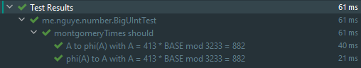

# RSA DIY with Large Numbers

## Conception de la structure Grand Nombre

Notre objet `BigUInt` stocke :

- `mag` : Un array de magnitude de type `UIntArray` avec les éléments de taille maximum $2^{31}=2147483648$, en little endian. 

(Nous ne prenons pas $2^{32}$ simplement parce qu'il y a des pertes de performances avec de nombreuses conversions vers `ULong`)

Si nous devons analyser un String, celui-ci sera convertit en base $2^{31}$

Example :

```kotlin
BigUInt.valueOf("2147483648", radix=10)
```

Ce qui donne dans l'objet :

```json
{
    "mag": {0, 1},
}
```

<div style="page-break-after: always; break-after: page;"></div>

## Instancier `BigUInt`

### Constructeur

Nous n'avons qu'un constructeur :

```kotlin
class BigUInt {
    val mag: UIntArray

    constructor(mag: UIntArray) {
        this.mag = mag.stripTrailingZero()
    }
}
```

En Kotlin, cela se réduit à :

```kotlin
class BigUInt(mag: UIntArray) {
	val mag = mag.stripTrailingZero()
}
```

<div style="page-break-after: always; break-after: page;"></div>

### Parser un String (`BigUInt.valueOf`)

L'algorithme est assez simple, mais ne supporte que les bases 2 à 36 (car, en base 36, contient les caractères 0-9a-z).

En résumé :

- Vérifie s'il existe un signe et attribue l'espace en fonction de la présence de signe.
- Convertit les charactères en digit et les stocke dans un array.
- Convertit cet array de base `radix` en base $2^{31}$

```kotlin
fun valueOf(str: String, radix: Int = DEFAULT_BASE_STRING): BigUInt {
    var i = 0
    val array = if (str.first() == '-' || str.first() == '+') {
        i++
        UIntArray(str.length - 1)
    } else {
        UIntArray(str.length)
    }

    for (j in array.size - 1 downTo 0) {
        array[j] = Character.digit(str[i], radix).toUInt()
        i++
    }

    // Convert array in base `radix` to base 2^EXPONENT
    val mag = array.toBase2PowK(radix.toUInt(), EXPONENT)
    return BigUInt(mag)
}
```

Ici, `EXPONENT=31`.

Note : Sur Kotlin, chaque expression de contrôle de flux permet de retourner la dernière valeur. Exemple :

```kotlin
val a = if (condition) {
    println("...")
    32  // This is returned because it is the last line of the expression
} else {
    println("...")
    12  // This is returned because it is the last line of the expression
}
```

Cela permet de remplacer l'opérateur ternaire de Java (`condition ? returnMeIfTrue : returnMeIfFalse`).

Notez que cette méthode est une [**méthode factory**](https://refactoring.guru/design-patterns/factory-method). Ce qui signifie qu'elle doit être stocké dans un objet factory ayant un cycle de vie de [singleton](https://refactoring.guru/design-patterns/singleton).

En Kotlin, cela se résume à faire un [`companion object`](https://kotlinlang.org/docs/reference/object-declarations.html) :

```kotlin
class BigUInt(mag: UIntArray) {
    ...
    companion object {
        private const val DEFAULT_BASE_STRING = 10
        private const val BASE = 2147483648u  // 2.pow(31)
        private const val EXPONENT = 31

        fun valueOf(str: String, radix: Int = DEFAULT_BASE_STRING): BigUInt {
            // ...
        }
    }
}
```

Ce qui permet d'utiliser la méthode sans instancier :

```kotlin
BigUInt.valueOf("12345", 10)
```

`object` sous Kotlin est un singleton et permet de stocker des variables ou méthodes existant sur toute l'application. (En gros, c'est une méthode `static` au sens de C++, c'est-à-dire, partagé entre toutes les instances de classes).

Exemple :

```kotlin
object ImASingleton {
    fun hello() {}
}

ImASingleton.hello()
```

`companion object` associe la classe mère (ici, `BigUInt`) avec l'`object`.

```kotlin
class ImNotASingletonBut {
    companion object {  // But, this is a Singleton
        fun hello() {}
    }
}

ImNotASingletonBut.hello()
```

Nous avons définie des classes utilitaires pour convertir des arrays d'une base à une autre.

Convertisseur base $n$ vers base $2^k$ :

```kotlin
/**
 * Convert a array in [radix] to an array in base 2.pow(k)
 *
 * Algorithm Description :
 * -  Convert the source in binary
 * -  Combine chunks of digit into one
 *
 * Self-Explanatory Example with *137 to base 16 (2^4)*:
 * -  137 = 0b10001001
 * -  0b10001001 = 1000 | 1001 = 0x89
 */
@ExperimentalUnsignedTypes
fun UIntArray.toBase2PowK(radix: UInt, k: Int): UIntArray {
    val thisBase2 = this.toBase2Array(radix)
    val result = UIntArray(size = thisBase2.size / k + 1)

    for (chunkIndex in result.indices) {
        for (offset in 0 until k) { // k = chunckSize
            // result[chunkIndex] += x * 2.pow(offset)
            //
            // x is a bit. x = thisBase2.mag[chunkIndex * k + offset]
            // If thisBase2.mag[chunkIndex * k + offset] fails, it returns 0u.
            result[chunkIndex] += thisBase2.elementAtOrElse(chunkIndex * k + offset) { 0u } shl offset
        }
    }

    return result
}
```

Le convertisseur base $n$ vers base $2$ :

```kotlin
/**
 * Convert BigInt magnitude array to base 2.
 *
 * Algorithm description: Division method.
 */
@ExperimentalUnsignedTypes
fun UIntArray.toBase2Array(radix: UInt): UIntArray {
    val size = ceil(this.size * log2(radix.toDouble())).toInt()
    val result = UIntArray(size)
    val zero = uintArrayOf(0u)

    var i = 0
    var num = this
    while (!num.contentEquals(zero)) {
        result[i] = num[0] % 2u // num % 2
        num = num.divBy2(radix).stripTrailingZero()
        i++
    }

    return result
}
```

Le `divBy2(radix)` :

```kotlin
/**
 * Considering that UIntArray is a array of digit. Return this / 2
 *
 * Algorithm description:
 * `(a_0 + a_1 * base + ... + a_n * base^n)/2` can be developed to
 * `a_0/2 + (a_1 * base)/2 + ... + (a_n * base^n)/2`. If one of the division has a carry (i.e is impair), then
 *  this carry will pass to the i - 1 th element.
 *
 * So, to summarize:
 * -  Loop from the nth element to the zeroth element
 *    - Add the carry if exist
 *    - Store the new carry if impair
 *    - Divide by 2 the element
 */
@ExperimentalUnsignedTypes
fun UIntArray.divBy2(radix: UInt): UIntArray {
    val zero = uintArrayOf(0u)
    val one = uintArrayOf(1u)
    if (this.contentEquals(zero) || this.contentEquals(one)) return zero
    val result = this.copyOf()

    var carry = 0u
    for (i in size - 1 downTo 0) {
        result[i] = result[i] + carry
        carry = if (result[i] % 2u == 1u) radix else 0u // Store carry if remainder exist
        result[i] = result[i] shr 1 // Div by 2
    }

    return result
}
```

<div style="page-break-after: always; break-after: page;"></div>

## Comparaison

### Implémenter `Comparable<BigUInt>`

Nous faisons cela, parce qu'un nombre est comparable et aidera les futures implémentations :

```kotlin
class BigUInt(mag: UIntArray) : Comparable<BigUInt> {
    override fun compareTo(other: BigUInt): Int {
        TODO("Not implemented yet")
    }
    
    override fun equals(other: Any?): Boolean {
        TODO("Not implemented yet")
    }
}
```

### `compareTo`

L'algorithme est la suivant :

- Comparer la taille des arrays de magnitude
- Si les tailles sont les mêmes, comparer les digits en partant de la fin.

Soit, sur Kotlin :

```kotlin
override fun compareTo(other: BigUInt): Int {
    return this.compareUnsignedTo(other)
}
```

```kotlin
private fun compareUnsignedTo(other: BigUInt): Int {
    return when {
        this.mag.size < other.mag.size -> -1
        this.mag.size > other.mag.size -> 1
        else -> compareMagnitudeTo(other)
    }
}
```

```kotlin
private fun compareMagnitudeTo(other: BigUInt): Int {
    // Check for the first biggest number
    for (i in mag.size - 1 downTo 0) {
        if (mag[i] < other.mag[i]) {
            return -1
        } else if (mag[i] > other.mag[i]) {
            return 1
        }
    }
    return 0
}
```

### `equals`

```kotlin
override fun equals(other: Any?): Boolean {
    if (this === other) return true
    if (javaClass != other?.javaClass) return false

    other as BigUInt

    if (this.compareTo(other) != 0) return false

    return true
}
```

<div style="page-break-after: always; break-after: page;"></div>

## Opérateurs basique

### `unaryMinus` et `unaryPlus`

Opérateurs `+a` et `-a`. Rien de plus simple en non-signé :

```kotlin
operator fun unaryPlus() = this

operator fun unaryMinus() = this
```

### `plus`

Notre implémentation contient quelques conditions pour la sécurité :

```kotlin
operator fun plus(other: BigUInt): BigUInt {
    if (this == zero) return other
    if (other == zero) return this

    val result = this addMagnitude other

    return BigUInt(result)
}
```

Allons voir l'implémentation de `addMagnitude`.

```kotlin
private infix fun addMagnitude(other: BigUInt): UIntArray {
    val result = UIntArray(max(mag.size, other.mag.size) + 1)
    var carry = 0uL
    var i = 0

    // Add common parts of both numbers
    while (i < mag.size && i < other.mag.size) {
        val sum: ULong = mag[i] + other.mag[i] + carry
        result[i] = (sum % BASE).toUInt()
        carry = sum / BASE
        i++
    }

    // Add the last part
    while (i < mag.size) {
        val sum: ULong = mag[i] + carry
        result[i] = (sum % BASE).toUInt()
        carry = sum / BASE
        i++
    }
    while (i < other.mag.size) {
        val sum: ULong = other.mag[i] + carry
        result[i] = (sum % BASE).toUInt()
        carry = sum / BASE
        i++
    }

    // Add the last carry (if exists)
    if (carry > 0u) result[i] = carry.toUInt()
    return result
}
```

Notez le `infix` à la déclaration de la fonction. Cela permet `a addMagnitude b ` en plus de `a.addMagnitude(b)`.

Ici, il s'agit de l'algorithme de l'addition cas d'école:

- `val sum = mag[i] + other.mag[i] + carry` est assez explicite, nous additionnons digits par digits.
- `result[i] = sum % base` permet d'éviter l'overflow de la base. Si cela overflow (`sum / base > 0`), alors nous mettons cet overflow dans le carry : `carry = sum / base`.

<div style="page-break-after: always; break-after: page;"></div>

### `minus`

Notre implémentation contient quelques conditions pour la sécurité :	

```kotlin
operator fun minus(other: BigUInt): BigUInt {
    if (this == zero) return other
    if (other == zero) return this

    val result = this subtractMagnitude other

    return BigUInt(result)
}
```

Allons voir `subtractMagnitude`.

```kotlin
private infix fun subtractMagnitude(other: BigUInt): UIntArray {
    val result = UIntArray(max(mag.size, other.mag.size))
    var carry = 0uL

    val (largest, smallest) = if (this.compareUnsignedTo(other) < 0) {
        other to this
    } else {
        this to other
    }

    // Subtract common parts of both numbers
    for (i in smallest.mag.indices) {
        var sub: ULong
        if (largest.mag[i] < carry + smallest.mag[i]) {
            sub = largest.mag[i] + (largest.base - carry - smallest.mag[i])
            carry = 1u
        } else {
            sub = largest.mag[i] - smallest.mag[i] - carry
            carry = 0u
        }
        result[i] = sub.toUInt()
    }

    // Subtract the last part
    for (i in smallest.mag.size until largest.mag.size) {
        var sub: ULong
        if (largest.mag[i] < carry) {
            sub = largest.mag[i] + (largest.base - carry)
            carry = 1u
        } else {
            sub = largest.mag[i] - carry
            carry = 0u
        }
        result[i] = sub.toUInt()
    }
    return result
}
```

L'algorithme de la soustraction **non signé** est également classique et assez similaire à l'addition :

- Partir du plus petit et soustraire les parties communes.
  - `largest.mag[i] - smallest.mag[i] - carry` est assez explicite
  - `if (largest.mag[i] < smallest.mag[i] + carry)` vérifie s'il existe un carry (e.g : "sub est-il négatif ?" ou "sub est-il en underflow ?").
    - Si oui, alors on fait remonter dans les nombres positifs en ajoutant `base` et on stocke (`1u`) dans le carry.
- Finir par la dernière partie.

<div style="page-break-after: always; break-after: page;"></div>

### `times`

Rien de surprenant non plus :

```kotlin
operator fun times(other: BigUInt): BigUInt {
    if (this == zero || other == zero) return zero

    val result = UIntArray(mag.size + other.mag.size)

    // School case multiplication
    for (i in other.mag.indices) {
        var carry = 0uL
        for (j in mag.indices) {
            // Note: ULong is **necessary** to avoid overflow of other.mag[i] * mag[j].
            val sum: ULong = result[i + j].toULong() + other.mag[i].toULong() * mag[j].toULong() + carry
            carry = sum / BASE
            result[i + j] = (sum % BASE).toUInt()
        }
        result[i + mag.size] = carry.toUInt()
    }

    return BigUInt(result)
}
```

Il s'agit du cas d'école. La seule différence est `carry = result[i + j] / BASE` et `result[i + j] = result[i + j] % BASE`.

De la même manière que `plus` et `minus`, `% BASE` et `/ BASE` permet d'éviter l'overflow de la base. `% BASE` va faire que le nombre dépasse pas la base et `/ base` récupère le carry.

<div style="page-break-after: always; break-after: page;"></div>

### `magShl` ou littéralement "shift left magnitude array"

En little-endian, `nombre magShl n` divisera le nombre par $base^n$ (où $base = 2^{31}$).

L'implémentation est immédiate :

```kotlin
infix fun magShl(n: Int): BigUInt {
    if (n == 0) return this
    val result = if (n < mag.size) mag.copyOfRange(n, mag.size) else uintArrayOf(0u)
    return BigUInt(result)
}
```

### `remMagShl` ou le reste de `magShl`

L'algorithme est choisi est le cas d'école :

```kotlin
infix fun remMagShl(k: Int): BigUInt {
    if (k == 0) return zero

    val divResult = this magShl k
    return this - basePowK(k) * divResult
}
```

Car le reste de $x / n^k$ est $rem = x - n^k \times \lfloor\frac{x}{n^k}\rfloor$ puisque $\text{remainder} = x - \text{other} \times \text{quotient}$.

Note : L'implémentation de `basePowK`.

```kotlin
private fun basePowK(k: Int): BigUInt {
    val mag = UIntArray(k + 1).apply {
        set(k, 1u)
    }
    return BigUInt(mag)
}
```

Sur Kotlin, `apply` permet enchainer des opérations à la déclaration. Equivalent :

```kotlin
private fun basePowK(base: UInt, k: Int): BigUInt {
    val mag = UIntArray(k + 1)
    mag[k] = 1u
    return BigUInt(mag)
}
```

<div style="page-break-after: always; break-after: page;"></div>

### `div`

`div` est nécessaire d'être implémenté afin de faire l'opérateur `rem` (ou `%`) et de calculer le `modInverse`.

Cependant, `div` est actuellement lourd à implémenter. Par conséquent, **nous essaierons de l'éviter au mieux**.

L'implémentation est l'algorithme de *Binary Search* (recherche par dichotomie).

```kotlin
operator fun div(other: BigUInt): BigUInt {
    if (other == zero) throw ArithmeticException("/ by zero")
    if (this == one || this == zero) return zero

    var left = zero
    var right = this
    var prevMid = zero

    while (true) {
        val mid = left + (right - left).divBy2()

        val productResult = other * mid

        when {
            productResult == this || prevMid == mid -> { // Exit condition: mid = this / other.
                return mid
            }
            productResult < this -> { // mid < this / other. Too low.
                left = mid // x if after the middle.
            }
            else -> { // mid > this / other. Too high.
                right = mid // x is before the middle.
            }
        }
        prevMid = mid
    }
}
```

En effet, l'algorithme s'applique car $other \times x$ est strictement croissant et continue. Par conséquent, en appliquant cet algorithme, si $other \times mid = this$ alors $\frac{this}{other} = mid$.

L'implémentation de `divBy2()` est issue de l'implémentation de `UIntArray.divBy2`.

```kotlin
fun divBy2() = BigUInt(mag.divBy2(BASE))
```

**Déduction à propos choix de l'algorithme Binary Search : **Le choix de cet algorithme a actuellement un complexité faible : $\mathcal{O}(1)$ si `other` est un multiple de 2. **Cela influencera l'implémentation de l'algorithmie modulaire.**

### `rem` ou modulo

Même implémentation de `remMagShl`. Il s'agit du cas d'école.

```kotlin
operator fun rem(other: BigUInt): BigUInt {
    if (other == zero) throw ArithmeticException("/ by zero")
    if (this == other || other == one) return zero

    val divResult = this / other
    return this - other * divResult
}
```

<div style="page-break-after: always; break-after: page;"></div>

## `modInverse` avec pgcd(a, n) = 1

Maintenant, que nous avons implémenté `div`, nous pouvons implémenter `modInverse` selon l'[algorithme d'Euclide étendue](https://en.wikipedia.org/wiki/Extended_Euclidean_algorithm#Modular_integers) sachant `gcd(this, other) == 1` :

```kotlin
infix fun modInverse(other: BigUInt): BigUInt {
    if (other <= one) throw ArithmeticException("/ by zero")
    var (oldR, r) = this to other
    var (t, tIsNegative) = zero to false
    var (oldT, oldTIsNegative) = one to false

    while (oldR > one) {
        if (r == zero) throw ArithmeticException("/ by zero: not coprime with other")

        val q = oldR / r

        // (r, oldR) = (oldR - q * r, r)
        (oldR - q * r).let {
            oldR = r
            r = it
        }

        // (t, oldT) = (oldT - q * t, t)
        val qt = q * t
        val tempT = t
        val tempTIsNegative = tIsNegative
        if (tIsNegative == oldTIsNegative) {
            if (oldT > qt) { // oldT - q * t >= 0. Default case.
                t = oldT - qt
                tIsNegative = oldTIsNegative
            } else { // oldT - q * t < 0. We swap the members.
                t = qt - oldT
                tIsNegative = !tIsNegative // Switch the sign because oldT - q * t < 0
            }
        } else { // oldT and t don't have the same sign. The subtraction become an addition.
            t = oldT + qt
            tIsNegative = oldTIsNegative
        }
        oldT = tempT
        oldTIsNegative = tempTIsNegative
    }

    return if (oldTIsNegative) (other - oldT) else oldT
}
```

L'implémentation est plus facile avec des nombres signés. Nous n'aurions pas besoin de stocker le signe.

<div style="page-break-after: always; break-after: page;"></div>

## Algorithmie sous la forme de Montgomery

### `montgomeryTimes`

$A \otimes B = A \cdot B \cdot r^{-1} \operatorname{mod} n$

Rien d'extraordinaire. Nous suivons l'implémentation indiqué par l'algorithme de réduction de Montgomery.

```kotlin
fun montgomeryTimes(other: BigUInt, n: BigUInt, v: BigUInt): BigUInt {
    val s = this * other
    val t = (s * v) remMagShl n.mag.size // m % base.pow(n)
    val m = s + t * n
    val u = m magShl n.mag.size // m / base.pow(n)
    return if (u >= n) u - n else u
}
```

$v$ tel que  $n \cdot v \equiv -1 \bmod r$. $r$ tel que si $base^{k-1} \leqslant n < base^k$ alors $r = base^k$.

Notez `remMagShl` qui signifie "remainder of the shift `n.mag.size` times left of the magnitude array" soit "reste de $/base^\text{n.mag.size}$".

### Tests de `montgomeryTimes`

Avant de passer à la suite, il serait intéressant de tester `montgomeryTimes` pour passer sous la forme de Montgomery et afin de montrer l'utilisation de cette méthode.

Nous rappelons que la forme de Montgomery est $\phi(a) = a \cdot r \bmod n$.

Or :
$$
\begin{align*}
a \otimes r^2 \bmod n &= a \cdot r^2 \cdot r^{-1} \bmod n \\
&= a \cdot r \bmod n \\
&= \phi(a)
\end{align*}
$$


Inversement :
$$
\begin{align*}
\phi(a) \otimes 1 &= \phi(a) \cdot 1 \cdot r^{-1} \bmod n \\
&= a \cdot r \bmod n \cdot r^{-1} \bmod n \\
&= a \bmod n
\end{align*}
$$
Donc notre test est :

```kotlin
"A to phi(A) with A = 413 * BASE mod 3233 = 882" {
    val a = BigUInt.valueOf("413")
    val n = BigUInt.valueOf("3233")

    val r = BigUInt.basePowK(n.mag.size)
    val rSquare = BigUInt.basePowK(n.mag.size * 2) % n
    val v = r - (n modInverse r)
    val aMgy = a.montgomeryTimes(rSquare, n, v)

    v shouldBe BigUInt.valueOf("1721706655")
    aMgy shouldBe BigUInt.valueOf("882")
}
```

Note : Le test est sous format [Kotest](https://kotest.io).

Notez $v$ issue de l'identité de Bezout $r\cdot r' - n \cdot v = 1$ soit $n \cdot v \equiv -1 \bmod r$.

Nous pouvons également tester les 2 sens de transformation de Montgomery :

```kotlin
"phi(A) to A with A = 413 * BASE mod 3233 = 882" {
    val a = BigUInt.valueOf("413")
    val n = BigUInt.valueOf("3233")

    val r = BigUInt.basePowK(n.mag.size)
    val rSquare = BigUInt.basePowK(n.mag.size * 2) % n
    val v = r - (n modInverse r)

    val aMgy = a.montgomeryTimes(rSquare, n, v)
    val aNotMgy = aMgy.montgomeryTimes(BigUInt.one, n, v)

    aNotMgy shouldBe a
}
```

Ce qui donne :



<div style="page-break-after: always; break-after: page;"></div>

### `modPow`, exponentiation modulaire avec la réduction de Montgomery

L'algorithme utilisé est [*square-and-multiply*](https://en.wikipedia.org/wiki/Exponentiation_by_squaring).

```kotlin
fun modPow(exponent: BigUInt, n: BigUInt): BigUInt {
    val exponentBase2 = exponent.mag.toBase2Array(radix=BASE)
    val r = basePowK(n.mag.size)
    val rSquare = basePowK(n.mag.size * 2) % n

    // v*n = -1 mod r = (r - 1) mod r
    val v = r - (n modInverse r)

    // Put this in montgomery form
    val thisMgy = this.montgomeryTimes(rSquare, n, v)

    var p = r - n // 1 in montgomery form
    for (i in exponentBase2.size - 1 downTo 0) {
        p = p.montgomeryTimes(p, n, v) // Square : p = p*p
        if (exponentBase2[i] == 1u) {
            p = p.montgomeryTimes(thisMgy, n, v) // Multiply : p = p * a
        }
    }

    // Return the result in the standard form
    return p.montgomeryTimes(one, n, v)
}
```

Faisons ligne par ligne :

- `val exponentBase2 = exponent.toBase2Array(radix=BASE)` permet exponentiation via l'algorithme square-and-multiply. 

- `val r = basePowK(n.mag.size)`, car, $r$ est choisi tel que si $base^{k-1} \leqslant n < base^k$ alors $r = base^k$ pour que $r$ soit premier avec $n$.

- `val rSquare = basePowK(n.mag.size * 2) % n` est $r^2 \bmod n$

- `val v = r - (n modInverse r)` est un coefficient de Bezout issue de $r\cdot r' - n \cdot v = 1$.

- ```kotlin
  var p = r - n // 1 in montgomery form
  for (i in exponentBase2.mag.size - 1 downTo 0) {
      p = p.montgomeryTimes(p, n, v) // Square : p = p*p
      if (exponentBase2.mag[i] == 1u) {
          p = p.montgomeryTimes(thisMgy, n, v) // Multiply : p = p * a
      }
  }
  ```

  est l'algorithme *square-and-multiply*.

  Elle fonctionne de la manière suivante : 

  - Si $x^k$, alors $k$ est décomposable en base 2. (exemple si $k = 22 = (10110)_2$) Donc, $x^k = x^{a_n 2^n + ... + a_0}$. ($x^{22} = x^{16+4+2} = x^{16}x^4x^2$)

  - Si il y a des 1, alors il faut multiplier, car $x^a \cdot x^b = x^{a+b}$ (plus précisément : $x^{a_i2^i} \cdot x^{a_j2^j} = x^{a_i2^i + a_j2^j}$).
  - Nous utilisons "square" pour multiplier l'exposant par 2 (décaler à gauche les bits de l'exposant), car $x^a \cdot x^a = x^{2a}$ (plus précisément : $x^{a_i2^i} \cdot x^{a_i2^i} = x^{a_i2^{i+1}}$.
  - Donc, en reprenant l'exemple :
    - On itère 5 fois. Chaque itération (squaring) multiplie les exposants par 2.
    - La première multiplication à la première itération va permettre de construire $x^{16}$ grâce aux 4 itérations (square) restantes.
    - La deuxième multiplication à la troisième itération va permettre de construire $x^4$ grâce aux 2 itérations (square) restantes.
    - La troisième multiplication à la quatrième itération va permettre de construire $x^2$ grâce la dernière itération.

- `p.montgomeryTimes(one, n, v)` est la mise sous la forme "standard" (non-Montgomery).

<div style="page-break-after: always; break-after: page;"></div>

### Test de `modPow`

### Paramètres

- Base de travail : 10

- Entrées :

  ```txt
  d = 104055844167107781248589752608920442121435852413004719607463950823987312821132759166809988685882849660028713452809154247360580185712259277529373755633843749387184470871012615224812078370633557809434904918225321388120741945280206181683834799019246740113882929623211747709365319857181807977455643688718851270877
  c1 = 29075891562236853554062599128328159590183028980552101085544262704780053549534418578507236855720567419975163282590047789761592080601496152946952125090156744601158717295382511431523328696904736152776043566580142204885912443831792077784183631398221826664611547239837936198939692178263167338882034607609865731118
  c2 = 18843734104175461747620056345977644339191851013945250885633407629936001206924360108249391255994307246258972445193033936764824225343511129353256115730527634053372059460757473302517539364833128267263875409044686455385132768623440613529456243041634873615584800113654178971954173164382380348803475710656333741640
  n = 179769313486231590772930519078902473361797697894230657273430081157732675805500963132708477322407536021120113879871393357658789768814416622492847430639477074095512480796227391561801824887394139579933613278628104952355769470429079061808809522886423955917442317693387325171135071792698344550223571732405562649211
  ```

- Attendu :

  ```txt
  m1 = 123
  m2 = 200
  ```

### Code / Protocole

```kotlin
@ExperimentalTime
@ExperimentalUnsignedTypes
fun main() {
    println("decrypting")
    measureTime {
        val d = BigUInt.valueOf("...") // Entrée tronquée
        val c1 = BigUInt.valueOf("...") // Entrée tronquée
        val c2 = BigUInt.valueOf("...") // Entrée tronquée
        val n = BigUInt.valueOf("...") // Entrée tronquée
        println(c1.modPow(d, n))
        println(c2.modPow(d, n))
    }.also {
        println("Time Elapsed : $it")
    }
}
```

### Résultat

```txt
decrypting
{123}
{200}
Time Elapsed : 364ms
```

Résultat satisfaisant et rapide.

<div style="page-break-after: always; break-after: page;"></div>

## `Rsa`

Le comportement de RSA est immédiat :

```kotlin
@ExperimentalUnsignedTypes
object Rsa {
    fun decrypt(c: BigUInt, d: BigUInt, n: BigUInt) = c.modPow(d, n)

    fun encrypt(m: BigUInt, e: BigUInt, n: BigUInt) = m.modPow(e, n)
}
```
